# 基础知识

音乐其实是一个序列，以音调、节拍、节奏组合的

音调控制发音的高低，节拍控制音调之间间隔，节奏控制节拍的时间长度

## 音调

国际上标准音A4对应la，中心频率为440Hz

在数学上，相邻音符之间中心频率间隔倍率为2^(1/12)，约为1.0595

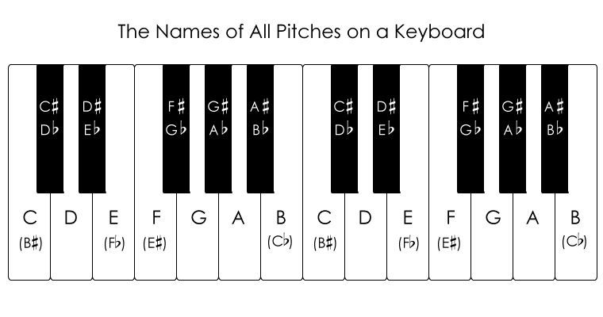

以钢琴为例，音频从低到高从左到右均匀分布在白键与黑键

我们可以将音调符号按照以下方式排列，

| C  | C# | D  | D# | E  | F  | F# | G  | G# | A  | A# | B  | C  |
|:--:|:--:|:--:|:--:|:--:|:--:|:--:|:--:|:--:|:--:|:--:|:--:|:--:|

井号表示升音，如果带了个类似b符号，则是降音

从C到C#，从C#到D，从D到D#，从D#到E，中心频率以2^(1/12)增长，也就是以1.0595倍增长

同样也必须注意到，符号从C到B为一轮，下一轮还是以C开始，从C到B总共有12个中心频率，那么下一轮C的中心频率是上一轮C的两倍

对应表示方法还有唱名记法，do re mi fa sol la si

以下是对应关系

| C  | D  | E  | F  | G   | A  | B  |
|:--:|:--:|:--:|:--:|:---:|:--:|:--:|
| do | re | mi | fa | sol | la | si |

其中标准A4音中心频率为440Hz

所以每个音符下一跳的中心频率是其自身频率的2倍

那么下一个A5音是880Hz，再下一跳是1760Hz

简而言之音符与音符之间符合的是倍频程关系

那么一个标准音符的下限频率为中心频率除以2^(1/24)，上限频率为中心频率乘以2^(1/24)

2^(1/24)约为1.0293，那么A4的上限频率为452.8920Hz，下限频率为427.4750Hz，中心频率为440Hz

应该要注意的是，从C到D，中心频率间隔倍率为2^(1/6)，约为1.1225

只有E到F，B到C中心频率间隔倍率才为2^(1/12)

弦乐如吉他和小提琴，自身存在不同冲激响应，所以产生不同音色，但是基础频率还是符合以上规律

五线谱上，谱线表示音调高低，如下图，音调从最下面的那条线，到最上面，依次升高

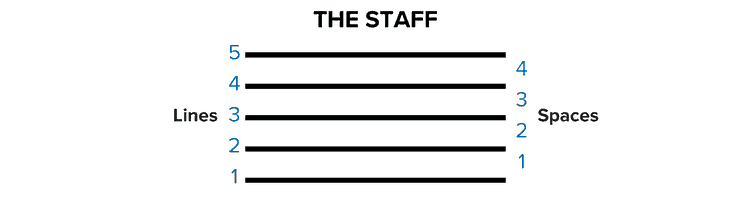

五线谱还需要注意到线之间间隔也可以表示音调，假如最下面1号线表示C音，那么1号线与2号线之间的1号间隔中心表示D音

注意到1号间隔不是表示C#音，五线谱并不是完全是2^(1/12)倍率增长，增长规律符合唱名记法

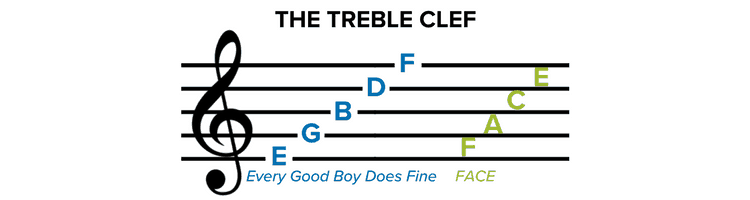

上图中最左边的符号是调号，作用其实是规定第二条线为G音，注意到符号圆圈与竖线锁定在第二条线，所以第二条线定义为G音

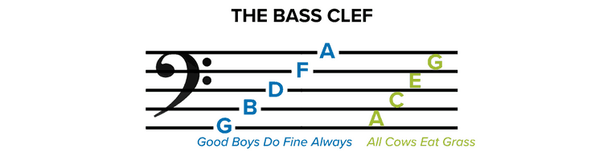

上图中最左边的符号作用其实是规定第四条线为F音，注意到符号两点锁定在第四条线，所以第四条线定义为F音

需要注意的是，数字信号音频在低频存在低分辨率问题，以44100Hz采样的音频为例，如果以4096样本数进行傅里叶变换，那么ΔHz为44100/4096，约为10.7666

然后10.766/(1-2^(1/12))，得到180.9513Hz，所以最低能清晰分辨的音调是180.9513Hz，也就是F3#音

要么提高采样分辨率，要么增加傅里叶变换的样本数，以提高在低音分辨率

## 节拍

节拍又叫beat，在音乐中，一个节拍是音乐的时间片，时间片可以进行细分，每次细分都是取半，也可以将节拍组合成更大时间片

这里引入音符（note）的概念，音符有全音符（whole note）、半音符（half note）、1/4音符（quarter note）、1/8音符（8th note）、1/16音符（16th note）

一拍（beat）就是一个1/4音符（note），那么全音符就是4拍，半音符就是2拍，1/8音符就是半拍，以此类推

音符还可以扩增长度，下图左边半音符加一点，意思半音符与1/4音符组合，表示单个音持续3/4个音符，也就是持续3拍，下图右边注意到有个弧线，连接半音符与1/4音符，也表示单个音持续3/4个音符

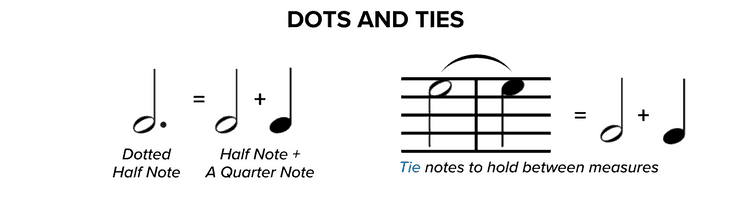

因此根据这样还可以推理，如果一个1/8音符带上个点，意思是1/8音符与1/16音符组合，得到3/16音符

下图则是1/4音符、1/8音符、1/16音符的等式，注意到1/8音符上杆子多了一个旗帜，1/16音符则有则有两个旗帜，说明多一个旗帜，单个音符占用节拍减半

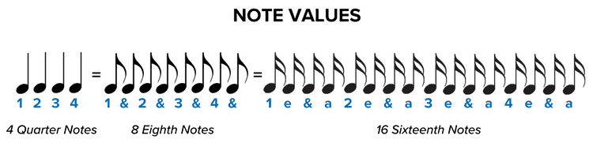

为了在五线谱上面书写简便，引入简写法，可以将旗帜合并成横杠，将两个等值音符组合起来，需要注意的是这种表示方法并不是单个音持续若干节拍

下图可以看到两个1/8音符组合，和1/16音符组合

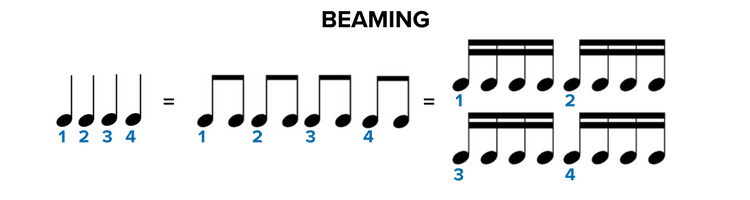

最后必须还要引入一个休止符概念，有全休止（whole rest）、半休止（half rest）、1/4休止（quarter rest）、1/8休止（8th rest）、1/16休止（16th休止）

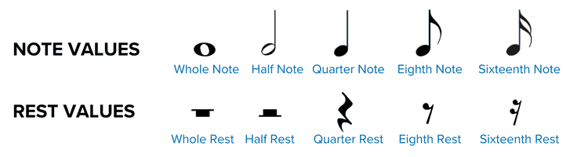

到这里我们介绍完了音符，但只有在五线谱上，音符才能表示音调高低

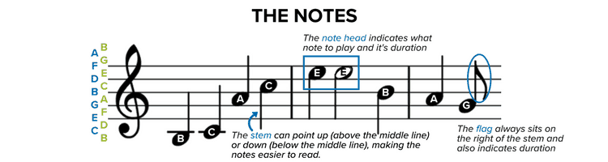

在前面已经知道，最左边符号表示第二条线表示G音，由此确定音调在五线谱的分布，音符的头所在位置控制音符的音调高低，当所需要的音调在五线谱表示以外，可以补上线和用字母表示音调

音符的头在中线以下时，杆子朝上，越过中线时杆子朝下

## 节奏

节奏又叫tempo，主要是控制节拍时间片

如果规定一个1/8音符为60BPM，那么，1/8音符一分钟60下，1/8音符占用时间为1秒，全音符为8秒，1/2音符为4秒，1/4音符为2秒，以此类推

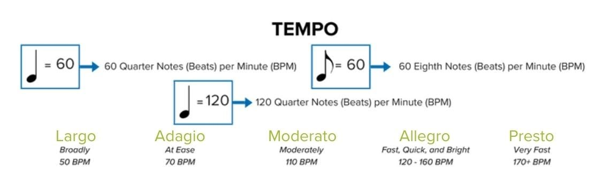

每个五线谱都会带上一个节拍签名，表示一个小节的节拍数和一个节拍的音符值，在这里可以忘记之前说的一拍=一个1/4音符，因为实际是节拍签名控制

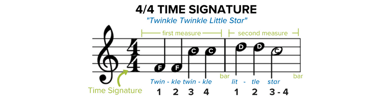

上面的4表示一个小节的节拍数，也就是黑色竖线之间的节拍数

下面的4表示一个节拍对应的音符，一个节拍对应一个1/4音符
